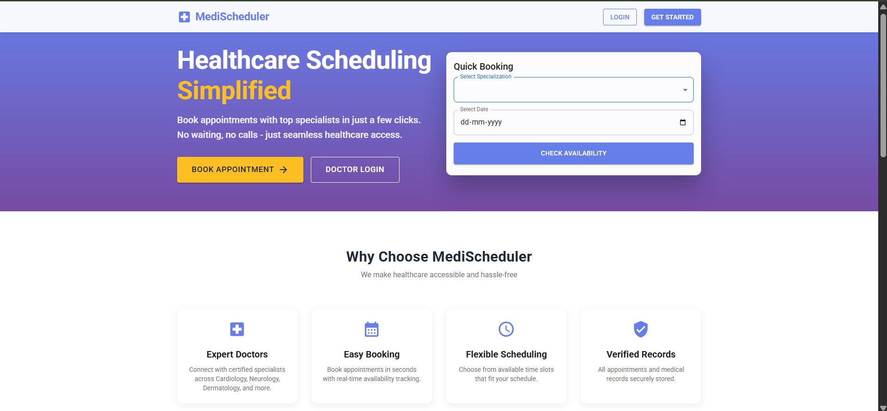
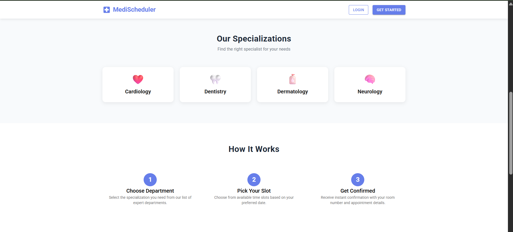
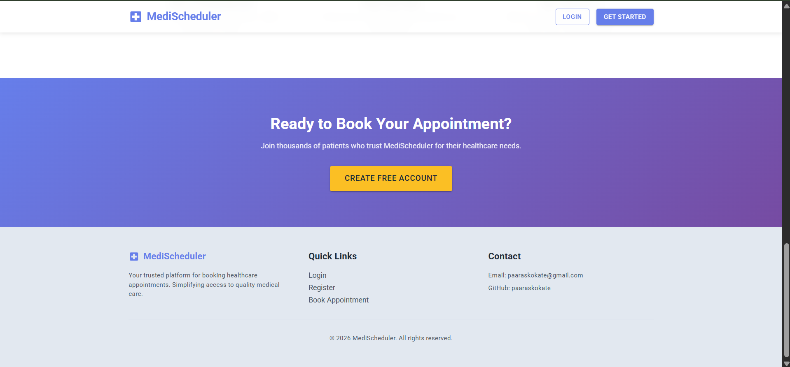
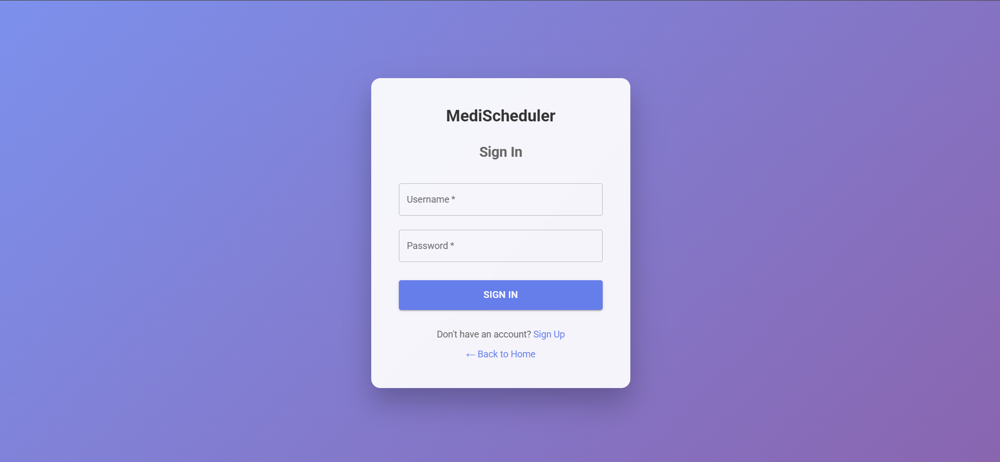
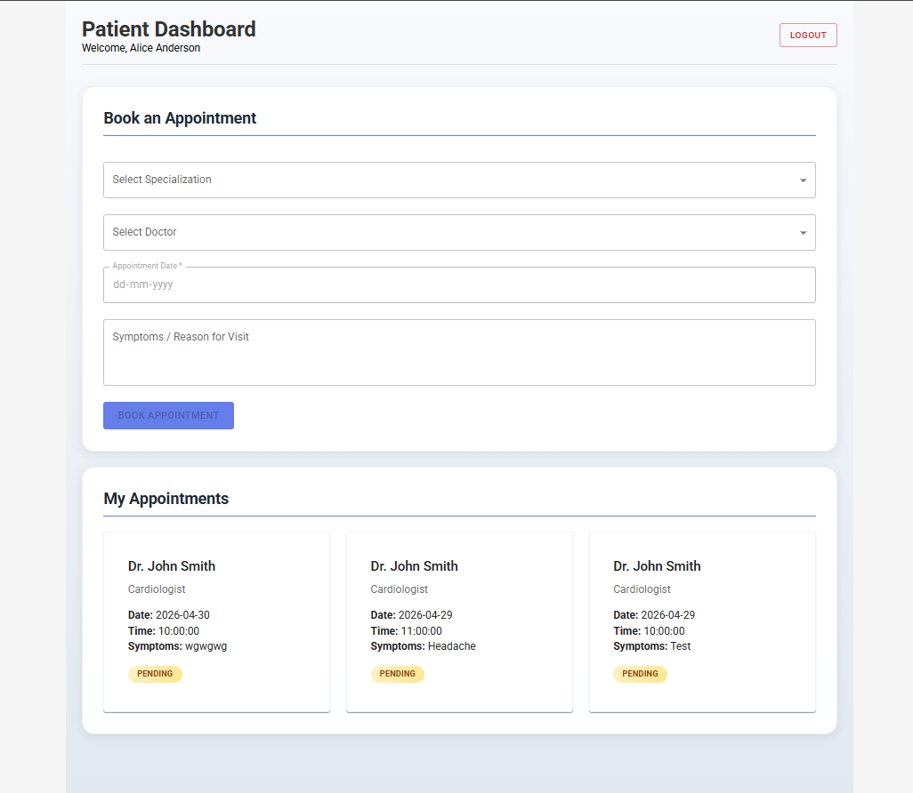
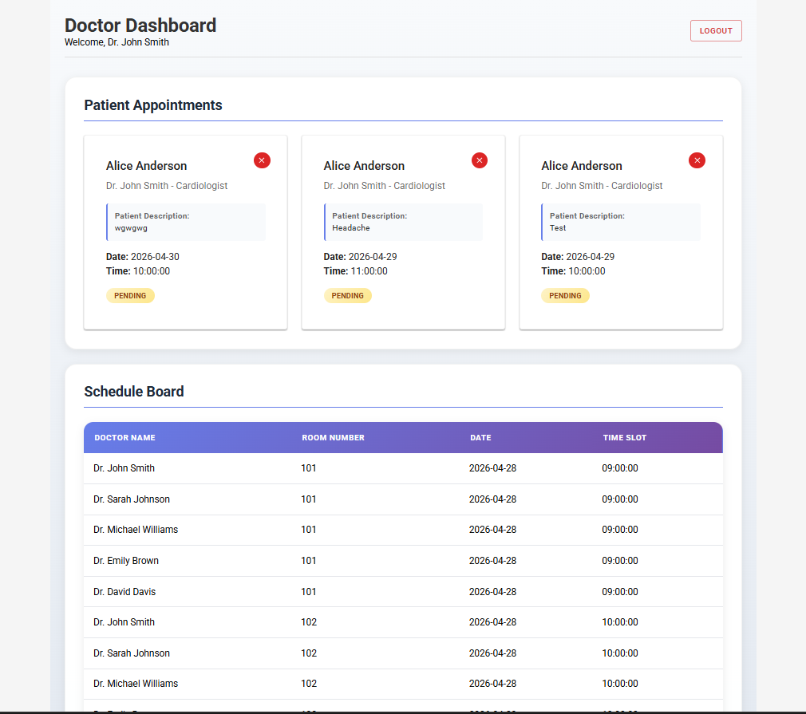

<p align="center">
  
</p>

# 🏥 MediScheduler - Healthcare Appointment Scheduler

<p align="center">
  
  
  
</p>

A full-stack healthcare appointment scheduling system built with Django REST Framework and React. MediScheduler simplifies the process of booking medical appointments by allowing patients to book appointments based on doctor availability with real-time time slot selection.

## 🌟 Features

### Role-Based Authentication
- **Patient** - Book appointments, view appointment status and room numbers
- **Doctor** - View patient appointments with symptoms, postpone appointments
- **Admin** - Full access to system management

### Patient Features
- 📋 Select doctor by specialization (Cardiologist, Dentist, Dermatologist, Neurologist)
- 📅 Pick from available time slots based on doctor's schedule
- 🏥 View appointment status (Pending → Accepted)
- 🚪 See room number when appointment is confirmed
- 📝 Add symptoms/description when booking

### Doctor Features
- 📋 View all patient appointments with patient descriptions
- 🔴 Postpone appointments (red button for emergency leave)
- 📊 View shared schedule board (all doctors' schedules)

### Smart Time Slot System
- ⏰ Automatic time slot availability
- 🏠 Room numbers assigned automatically
- ✓ Real-time slot checking - no doublebooking

## 📱 Screenshots

### Landing Page - Part 1


### Landing Page - Part 2


### Landing Page - Part 3


### Login Page


### Patient Dashboard


### Doctor Dashboard


## 🏗️ Project Structure

```
MediScheduler/
├── backend/                      # Django REST API
│   ├── medischeduler/          # Django project settings
│   │   ├── settings.py       # Django configuration
│   │   └── urls.py          # Main URL routing
│   ├── users/               # User authentication app
│   │   ├── models.py        # Custom User model with roles
│   │   ├── serializers.py  # Auth serializers
│   │   └── views.py       # Login/Register views
│   ├── doctors/             # Doctor profiles
│   │   ├── models.py       # DoctorProfile model
│   │   └── views.py       # Doctor list with filtering
│   ├── appointments/      # Appointment management
│   │   ├── models.py      # Appointment model
│   │   ├── serializers.py # Booking serializers
│   │   └── views.py      # Appointment viewsets
│   ├── schedules/          # Time slot management
│   │   ├── models.py     # Schedule model
│   │   └── views.py    # Schedule views
│   ├── requirements.txt   # Python dependencies
│   ├── manage.py         # Django CLI
│   └── create_dummy_data.py  # Seed data script
│
├── frontend/                 # React application
│   ├── public/
│   │   └── index.html
│   ├── src/
│   │   ├── pages/
│   │   │   ├── LandingPage.js    # Landing/Customize page
│   │   │   ├── Login.js         # Login page
│   │   │   ├── Register.js     # Registration page
│   │   │   ├── PatientDashboard.js
│   │   │   └── DoctorDashboard.js
│   │   ├── services/
│   │   │   └── api.js       # Axios API service
│   │   ├── context/
│   │   │   └── AuthContext.js # Auth context
│   │   ├── App.js          # Main app with routing
│   │   └── index.css      # Global styles
│   └── package.json
│
└── README.md               # This file
```

## 🛠️ Technology Stack

### Backend
| Technology | Version | Description |
|------------|---------|-------------|
| Django | 6.0.4 | Python web framework |
| Django REST Framework | 3.17.1 | REST API development |
| SimpleJWT | 5.5.1 | JWT authentication |
| Django CORS Headers | 4.9.0 | Cross-origin support |
| Django Filter | 25.2 | Advanced filtering |

### Frontend
| Technology | Version | Description |
|------------|---------|-------------|
| React | 18.3.1 | JavaScript library |
| Material UI | 5.17.1 | UI component library |
| Axios | 1.7.9 | HTTP client |
| React Router | 7.1.1 | Routing |

## 🚀 Setup Instructions

### Prerequisites
- Python 3.13+
- Node.js 18+
- npm or yarn

### Backend Setup

```bash
# Navigate to backend
cd MediScheduler/backend

# Create virtual environment
python -m venv venv

# Activate virtual environment
# Windows:
venv\Scripts\activate
# Linux/Mac:
source venv/bin/activate

# Install dependencies
pip install -r requirements.txt

# Run migrations
python manage.py migrate

# Create dummy data (5 doctors, schedules, patients)
python create_dummy_data.py

# Start server
python manage.py runserver 8000
```

### Frontend Setup

```bash
# Navigate to frontend
cd MediScheduler/frontend

# Install dependencies
npm install

# Build for production (recommended)
npm run build

# Or start development server
npm start
```

### Running the Application

1. **Start Backend** (Terminal 1):
```bash
cd MediScheduler/backend
python manage.py runserver 8000
```

2. **Start Frontend** (Terminal 2):
```bash
cd MediScheduler/frontend/build
python -m http.server 3000
```

3. **Open Browser**: http://localhost:3000

## 🔑 Login Credentials

After running `create_dummy_data.py`:

| Role | Username | Password |
|------|----------|----------|
| 🏥 Admin | admin | admin123 |
| 👨‍⚕️ Doctor | dr_smith | doctor123 |
| 👨‍⚕️ Doctor | dr_johnson | doctor123 |
| 👨‍⚕️ Doctor | dr_williams | doctor123 |
| 👨‍⚕️ Doctor | dr_brown | doctor123 |
| 👨‍⚕️ Doctor | dr_davis | doctor123 |
| 🙋 Patient | patient1 | patient123 |
| 🙋 Patient | patient2 | patient123 |

## 📡 API Endpoints

### Authentication
| Endpoint | Method | Description |
|----------|--------|-------------|
| `/api/auth/register/` | POST | Register new user |
| `/api/auth/login/` | POST | Login user |
| `/api/auth/logout/` | POST | Logout user |
| `/api/auth/me/` | GET | Get current user |
| `/api/auth/token/refresh/` | POST | Refresh JWT token |

### Doctors
| Endpoint | Method | Description |
|----------|--------|-------------|
| `/api/doctors/` | GET | List doctors |
| `/api/doctors/?specialization=cardiologist` | GET | Filter by specialization |

### Appointments
| Endpoint | Method | Description |
|----------|--------|-------------|
| `/api/appointments/` | GET | List appointments |
| `/api/appointments/` | POST | Create appointment |
| `/api/appointments/{id}/` | PATCH | Update status |
| `/api/appointments/available-slots/` | GET | Get available time slots |

### Schedules
| Endpoint | Method | Description |
|----------|--------|-------------|
| `/api/schedules/` | GET | List schedules |

## 📁 Environment Variables (Optional)

### Backend
```env
SECRET_KEY=your-secret-key
DEBUG=True
ALLOWED_HOSTS=localhost,127.0.0.1
```

### Frontend
```env
REACT_APP_API_URL=http://localhost:8000/api
```

## 🏭 Production Deployment

### Backend with Gunicorn
```bash
pip install gunicorn
gunicorn medischeduler.wsgi:application --bind 0.0.0.0:8000
```

### Frontend Build
```bash
npm run build
# Serve with any static file server
npx serve -s build -l 3000
```

## 📝 Key Implementation Details

### Time Slot System
- Each doctor has 6 time slots per day (9AM, 10AM, 11AM, 2PM, 3PM, 4PM)
- Room numbers automatically assigned from schedule table
- Slots marked unavailable when booked
- Patients pick from available slots only

### Patient Booking Flow
1. Select specialization → Filter doctors
2. Select doctor → View available dates
3. Select date → Fetch available time slots
4. Pick time slot → Book appointment
5. Receive confirmation with room number

### Doctor Workflow
1. View incoming appointments with patient symptoms
2. See room number automatically assigned
3. Postpone with red X button (releases time slot)

## 🤝 Contact

- **Email**: paaraskokate@gmail.com
- **GitHub**: https://github.com/paaraskokate

## � License

MIT License - See LICENSE file for details.

---

<p align="center">Made by <a href="https://github.com/paaraskokate">Paaras Kokate</a></p>
